# Ansible Policy as Code Tutorial

This tutorial assumes the user is running Mac OS environment, commands for Windows users will be provided at a later time. If you are a Windows user, please use the equivalent commands for your operating system.

## Table of Contents

- [Ansible Policy as Code Tutorial](#ansible-policy-as-code-tutorial)
  - [Table of Contents](#table-of-contents)
  - [TechZone VM Provisioning](#techzone-vm-provisioning)
  - [Install Ansible Automation Platform](#install-ansible-automation-platform)
    - [Obtain Ansible Automation Platform Software](#obtain-ansible-automation-platform-software)
    - [Install Single Node](#install-single-node)
    - [Register Subscription](#register-subscription)
  - [Clone GitHub Repositories](#clone-github-repositories)
  - [Install Open Policy Agent (Podman)](#install-open-policy-agent-podman)
  - [Configure Policy as Code Execution Environment](#configure-policy-as-code-execution-environment)
    - [Add Execution Environment](#add-execution-environment)
    - [Create API Key in IBM Cloud](#create-api-key-in-ibm-cloud)
    - [Add API Key to Ansible Automation Platform](#add-api-key-to-ansible-automation-platform)
    - [Create Policy as Code Project](#create-policy-as-code-project)
  - [Infrastructure as Code Deployment](#infrastructure-as-code-deployment)
  - [Resource Auditing & Remediation](#resource-auditing--remediation)

## TechZone VM Provisioning

1. Use the base image here from here [RHEL 8.6 VSI on IBM Cloud](https://techzone.ibm.com/my/reservations/create/62ab7e6c79c3250017398d8b)

1. Once the VM is provisioned, you will receive an email with a link to the Tech Zone reservation. There you will find details such as IP address and a link to download the SSH private key.

    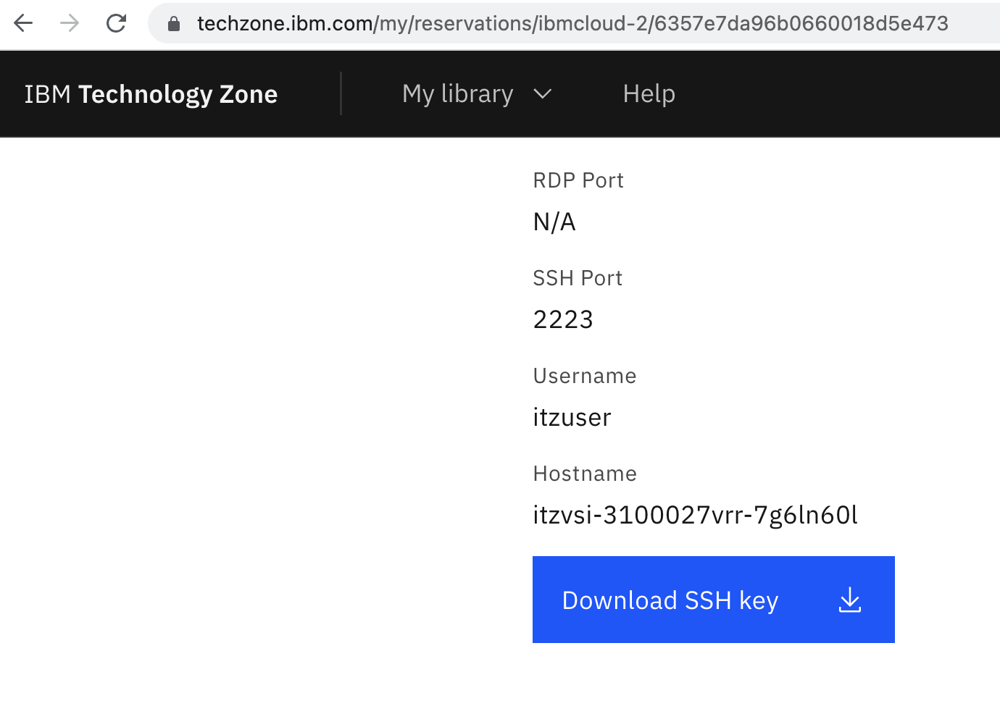

1. Once you have downloaded the key, note the key name. If you have previously downloaded keys, it may contain a postfix such as `(1)`, e.g. `pem_ibmcloudvsi_download (1).pem`. Then, run the following commands to move the key to your `.ssh` directory, updating the key name accordingly.

    ```shell
    mv ~/Downloads/pem_ibmcloudvsi_download\ \(1\).pem ~/.ssh/policy_as_code_tutorial.pem

    chmod 400 ~/.ssh/policy_as_code_tutorial.pem
    ```

1. Then, set the `TZ_AAP_IP_ADDRESS` shell environment variable with the public IP address of your VM from Tech Zone. E.g. given the IP address `150.240.71.92`, the command would be:

    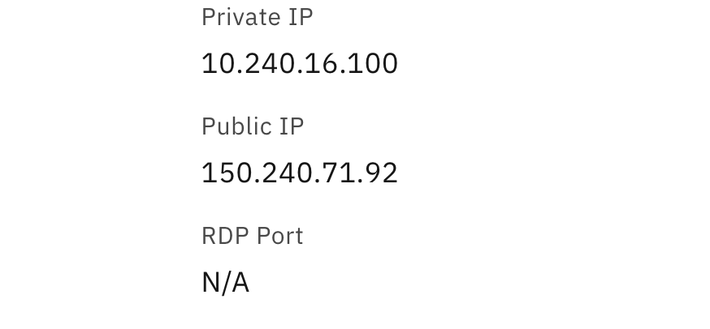

    ```shell
    export TZ_AAP_IP_ADDRESS="150.240.71.92"
    ```

## Install Ansible Automation Platform

### Obtain Ansible Automation Platform Software

1. Download the Ansible Automation Platform bundle here [AAP Bundle Download](https://developers.redhat.com/products/ansible/download)

2. Once you have downloaded, note the bundle name & version e.g. `ansible-automation-platform-setup-bundle-2.2.0-8.1.tar.gz` then, run the following commands, updating bundle name and version accordingly.

    ```shell
    scp -i ~/.ssh/policy_as_code_tutorial.pem -P 2223 ~/Downloads/ansible-automation-platform-setup-bundle-2.2.0-8.1.tar.gz itzuser@${TZ_AAP_IP_ADDRESS}:ansible-automation-platform-setup-bundle-2.2.0-8.1.tar.gz
    ```

### Install Single Node

1. SSH into the Tech Zone VM, unpack the software, and enter the directory.

    ```shell
    ssh -i ~/.ssh/policy_as_code_tutorial.pem -p 2223 itzuser@${TZ_AAP_IP_ADDRESS}

    tar -xvzf ansible-automation-platform-setup-bundle-2.2.0-8.1.tar.gz

    cd ansible-automation-platform-setup-bundle-2.2.0-8.1
    ```

1. Modify the `inventory` file to the following contents, where `10.X.X.X`  is the private IP address of your machine e.g. `10.240.16.100`.

    

    ```toml
    [automationcontroller]
    10.X.X.X ansible_connection=local

    [database]

    [all:vars]
    admin_password='password'

    pg_host=''
    pg_port=''

    pg_database='awx'
    pg_username='awx'
    pg_password='password'
    ```

1. Run the installation scripts as `root` user to install Ansible Automation Platform.

    ```shell
    sudo su

    ./setup.sh && exit
    ```

1. Once installation is finished, you may then log into Ansible Automation Platform by pasting the public IP of your VM into a browser. Then enter the credentials U: `admin` P: `password` . You will be presented with a screen that requires you to activate your subscription.

### Register Subscription

When you first login to Ansible Automation Platform, you will need to register your subscription. Follow these steps to get a trial license.

1. You can request a trial license from Red Hat using the following link: [Ansible Trial](https://www.redhat.com/en/technologies/management/ansible/trial). Login with your Red Hat account and proceed through the prompts.

1. Once you have an active trial, you can allocate that subscription using the following link: [Subscription Asset Manager](https://access.redhat.com/management/subscription_allocations)

1. Click "New Subscription Allocation" link, enter the following details and click "Create".

    **Name:** PaC_Tutorial

    **Type:** Subscription Asset Manager 1.4

    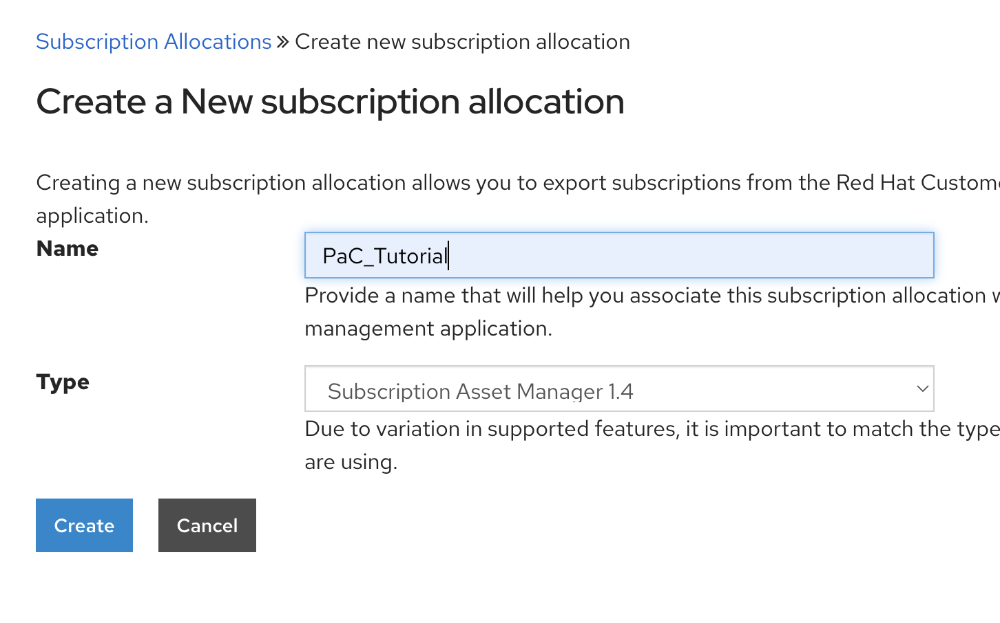

1. Click the "Subscriptions" tab and click "Add Subscriptions"

    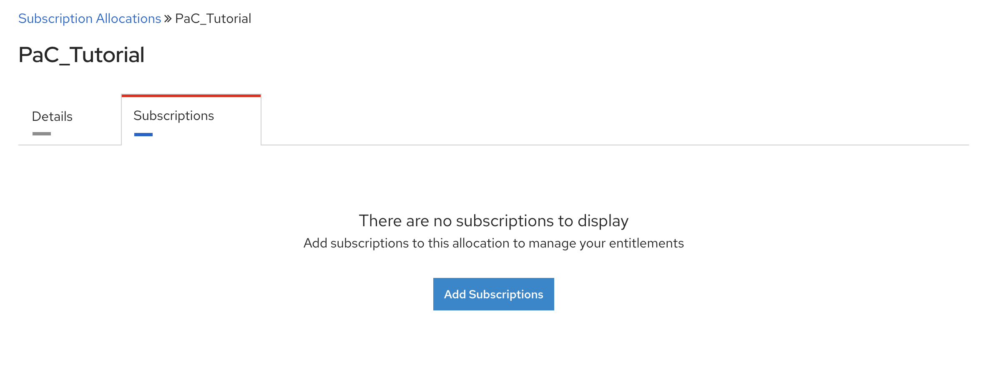

1. Search for the Ansible Trial licenses and add a few allocations e.g. 10 and click "Submit".

    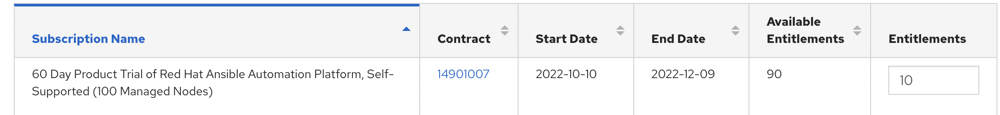

1. You can then click "Export manifest" button to download the manifest required to activate your subscription.

    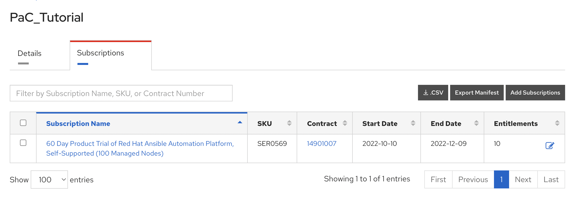

1. Navigate back to your Ansible Automation Platform screen and upload the manifest by clicking the "Browse" button and selecting the manifest zip e.g. `manifest_PaC_Tutorial_20221107T170958Z.zip`.

    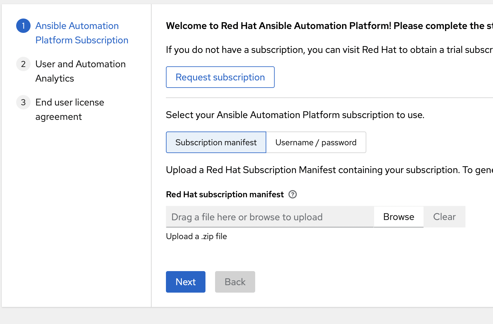

1. Click "Next", you may uncheck the Analytics request as below, and click "Next".

    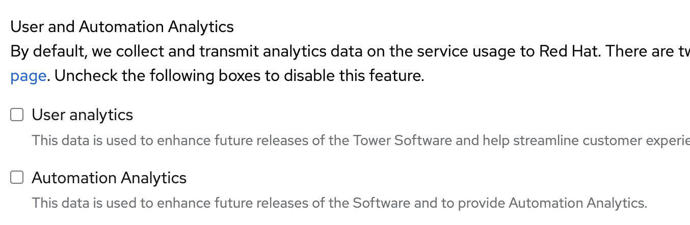

1. Finally, accept the license agreement by clicking "Submit".

## Clone GitHub Repositories

1. TODO: Clone the GitHub repositories, set environment variables, and ensure Docker build happens

## Install Open Policy Agent (Podman)

1. On the Ansible Automation Platform VM, run the following command to start Open Policy Agent, replacing `<your_username>` with your GitHub username or organization containing the cloned repositories.

    ```shell
    export GH_USERNAME=<your_username>

    podman run --name opa -d --publish 8181:8181 --restart always ghcr.io/${GH_USERNAME}/ansible-pac-test-policies:main
    ```

## Configure Policy as Code Execution Environment

### Add Execution Environment

1. Login to your Ansible Automation Platform and navigate to 'Administration -> Execution Environments' and create execution environment with the following configuration, replacing `<your_username>` with your GitHub username or organization containing the cloned repositories.

    **Name:** Policy as Code Execution Environment

    **Image:** ghcr.io/<your_username>/ansible-pac-test-ee:main

    **Pull:** Always pull container before running.

### Create API Key in IBM Cloud

TODO

### Add API Key to Ansible Automation Platform

In Ansible Automation Platform, create a new Credential Type for IBM Cloud by performing the following steps.

1. Navigate to 'Administration -> Credential Types'

1. Click 'Add', enter the following values, then save.

    **Name:** IBM Cloud Provider

    **Input Configuration (YAML):**

    ```yaml
    fields:
    - id: api_key
      type: string
      label: IBM Cloud API Key
      secret: true
    required:
    - api_key
    ```

    **Injector Configuration (YAML):**

    ```yaml
    env:
      IC_API_KEY: '{{ api_key }}'
    ```

1. Navigate to 'Resources -> Credentials', click 'Add' button, enter the following values, then save.

    **Name:** IBM Cloud API Key

    **Credential Type:** IBM Cloud Provider

    **IBM Cloud API Key:** [Your IBM Cloud API Key]

### Create Policy as Code Project

1. Create a new project by navigating to 'Resources -> Projects', click 'Add', enter the following values (replacing `<your_username>`) and save.

    **Name:** Policy as Code

    **Organization:** Default

    **Execution Environment:** Policy as Code Execution Environment

    **Source Control Type:** Git

    **Source Control URL:** [https://github.com/<your_username>/ansible-pac-test.git](https://github.com/<your_username>/ansible-pac-test.git)

    **Source Control Branch/Tag/Commit:** main

## Infrastructure as Code Deployment

The policy as code repository comes pre-configured with one policy that will be used. This policy checks if all IBM Cloudant resources have a tag matching regex `^costcenter:(\\d){6}$` i.e. in the format `costcenter:NNNNNN` where `N` is some number `0-9`. An excerpt of this policy implementation is provided below from `policies/corp/policies/policies.rego`:

```rego
policy_violations[CORP_040_00001_violation] {

    # select all resources that require a costcenter tag
    resources_requiring_costcenter_tag := array.concat(
        resources["ibm_cloudant"],
        []
    )

    # get a list of resources that comply with the costcenter tag policy
    with_costcenter_tag := { index |
        some index, tag

        # check that some tag matches the required regex for each
        regex.match(
            "^costcenter:(\\d){6}$", 
            resources_requiring_costcenter_tag[index].values.tags[tag]
        )
    }

    # get a list of of non-compliant resources [all resouces minus compliant resources]
    without_costcenter_tag := { index |
        some index
        resources_requiring_costcenter_tag[index]
        not with_costcenter_tag[index]
    }

    # loop through without_costcenter_tag[] and create a new policy violation
    CORP_040_00001_violation := new_violation(
        CORP_040_00001_id,
        resources_requiring_costcenter_tag[ without_costcenter_tag[_] ]
    )

}
```

The Terraform resources also contains a definition for an IBM Cloudant instance that does not conform to the policy above. We will configure Ansible Automation Platform to first check this infrastructure and only if it passes all policies, will it be deployed.

1. In Ansible Automation Platform, create a new Job Template by navigating to 'Resouces -> Templates', clicking 'Add -> Add job template', entering the following values and then clicking 'Save'.

    **Name:** Check Terraform

    **Job Type:** Check

    **Inventory:** Demo Inventory

    **Project:** Policy as Code

    **Execution Environment:** Policy as Code Execution Environment

    **Playbook:** playbooks/check-terraform.yaml

    **Credentials (Selected Category):** IBM Cloud Provider

    **Credentials (Selected):** IBM Cloud API Key

    **Variables:**

    ```yaml
    policy_as_code_plan_validation_url: "http://<tz_aap_public_ip>:8181/v1/data/corp/policies"
    ```

    *Note: Update `<tz_aap_public_ip>` to the public IP of your Ansible Automation Platform instance*

1. Add a second job template as before with the following values:

    **Name:** Deploy Terraform

    **Job Type:** Run

    **Inventory:** Demo Inventory

    **Project:** Policy as Code

    **Execution Environment:** Policy as Code Execution Environment

    **Playbook:** playbooks/deploy-terraform.yaml

    **Credentials (Selected Category):** IBM Cloud Provider

    **Credentials (Selected):** IBM Cloud API Key

1. Create a Workflow template to connect the two Job templates that were just created by navigating to 'Resources -> Templates' and click 'Add -> Add workflow template' with the following values:

    **Name:** Check & Deploy Terraform

    **Inventory:** Demo Inventory

    **Project:** Policy as Code

1. After you click 'Save' you will be presented with a screen to create the workflow. First, select the 'Check Terraform' template and add to Workflow. Then add the 'Deploy Terraform' job after the 'Check Terraform' with the option 'On Success'. Finally, click 'Save'.

1. You may then run the workflow by clicking the 'Launch' button.

1. On the first run, you will see the 'Check Terraform' job fail. This is because the Cloudant instance fails to meet policy requirements.

    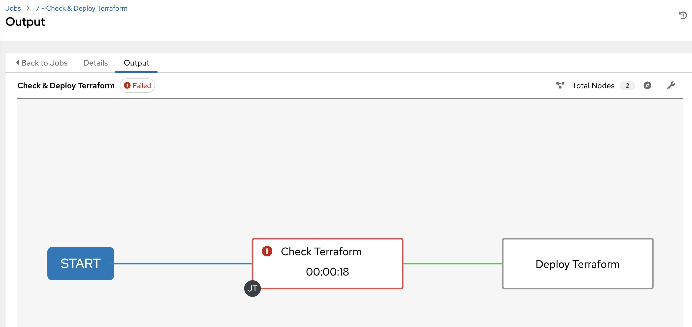

    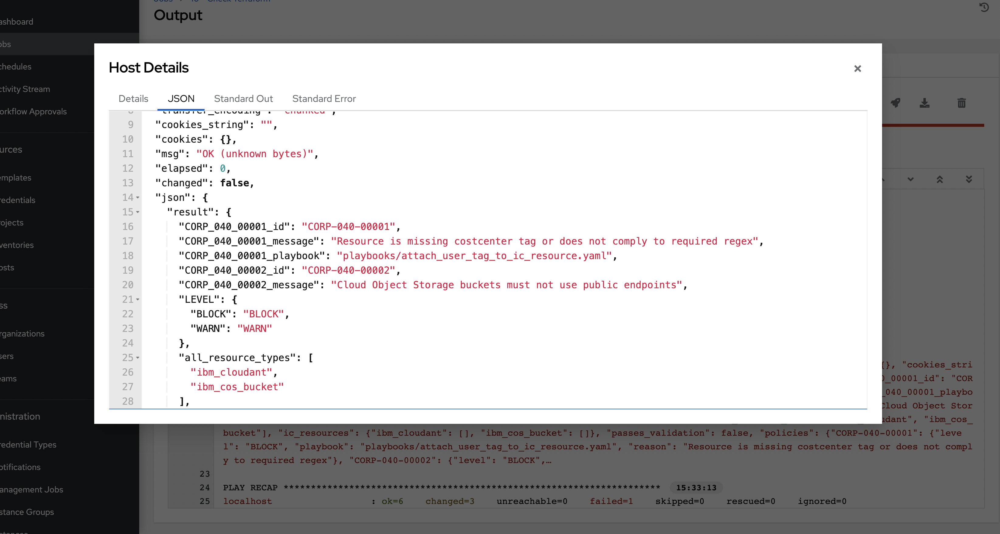

1. Next, you should update the `tags` line for the `ibm_cloudant.cloudant` resource inside of `terraform/main.tf` file to add tags by removing the comment. After you remove the commented line, that block should appear as the following:

    ```terraform
    resource "ibm_cloudant" "cloudant" {
        name     = "policy-as-code-cloudant"
        location = "us-south"
        plan     = "lite"
        tags     = ["costcenter:001589"]

        timeouts {
            create = "15m"
            update = "15m"
            delete = "15m"
        }
    }
    ```

1. Commit the changes and rerun the 'Check & Deploy Terraform' workflow. Note: if you do not have an upgraded IBM Cloud account, you must not have any other Cloudant instance or your deployment will fail.

    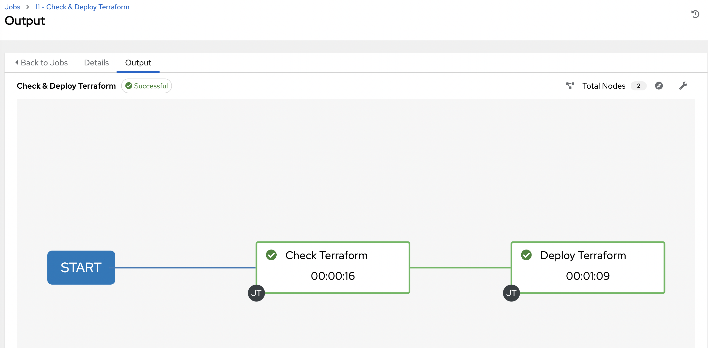

1. You should also see the Cloudant instance in the IBM Cloud dashboard.

    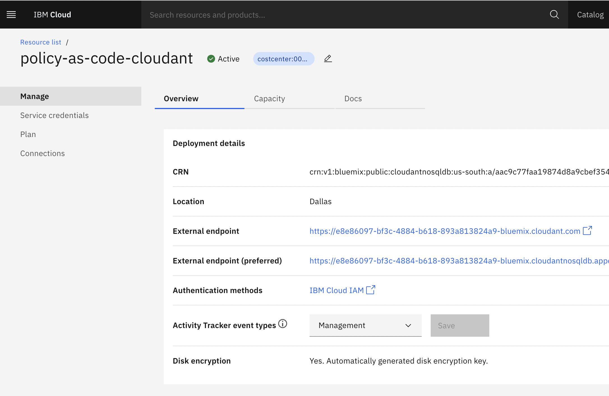

## Resource Auditing & Remediation

The audit playbook will detect policy violations for running instances. Follow these steps to provision the audit playbook job. This section assumes that you have completed the [Infrastructure as Code Deployment](#infrastructure-as-code-deployment) section and have the resulting Cloudant instance.

1. In Ansible Automation Platform, create a new Job Template by navigating to 'Resouces -> Templates', clicking 'Add -> Add job template', entering the following values and then clicking 'Save'.

    **Name:** Audit Cloudant Instances

    **Job Type:** Run

    **Inventory:** Demo Inventory

    **Project:** Policy as Code

    **Execution Environment:** Policy as Code Execution Environment

    **Playbook:** playbooks/cloudant-audit.yaml

    **Credentials (Selected Category):** IBM Cloud Provider

    **Credentials (Selected):** IBM Cloud API Key

    **Variables:**

    ```yaml
    policy_as_code_plan_validation_url: "http://<tz_aap_public_ip>:8181/v1/data/corp/policies"
    ```

    *Note: Update `<tz_aap_public_ip>` to the public IP of your Ansible Automation Platform instance*

1. Run the audit job by clicking the 'Launch' button. If you do not have any Cloudant instances other than the one configured previously, you should then see a successful run as the instance passes validation.

    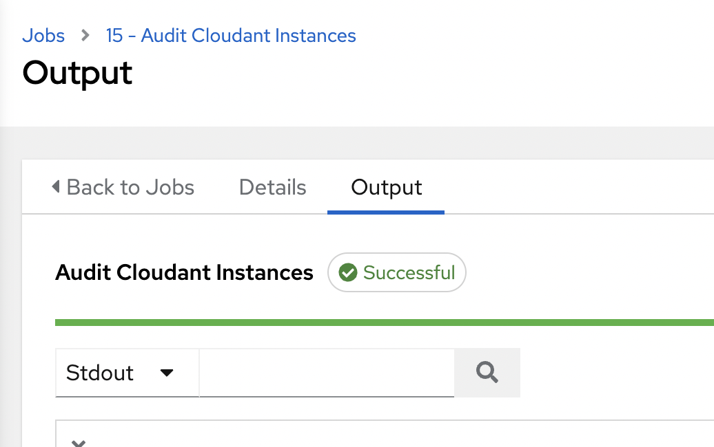
