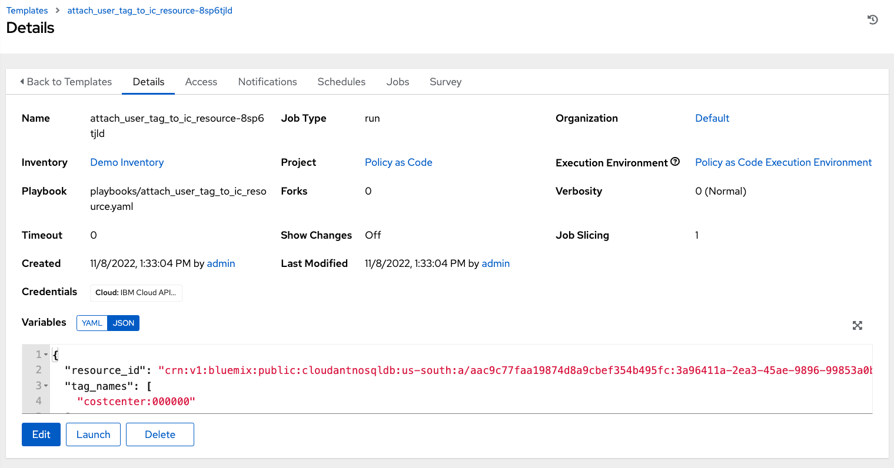

# Ansible Policy as Code Tutorial

This tutorial assumes the user is running Mac OS environment, commands for Windows users will be provided at a later time. If you are a Windows user, please use the equivalent commands for your operating system.

## Table of Contents

- [Ansible Policy as Code Tutorial](#ansible-policy-as-code-tutorial)
  - [Table of Contents](#table-of-contents)
  - [TechZone VM Provisioning](#techzone-vm-provisioning)
  - [Install Ansible Automation Platform](#install-ansible-automation-platform)
    - [Obtain Ansible Automation Platform Software](#obtain-ansible-automation-platform-software)
    - [Install Single Node](#install-single-node)
    - [Register Subscription](#register-subscription)
  - [Fork Tutorial Repository](#fork-tutorial-repository)
  - [Install Open Policy Agent (Podman)](#install-open-policy-agent-podman)
  - [Configure Policy as Code Execution Environment](#configure-policy-as-code-execution-environment)
    - [Add Execution Environment](#add-execution-environment)
    - [Create API Key in IBM Cloud](#create-api-key-in-ibm-cloud)
    - [Add API Key to Ansible Automation Platform](#add-api-key-to-ansible-automation-platform)
    - [Add Ansible Automation Platform Credentials for Use in Playbooks](#add-ansible-automation-platform-credentials-for-use-in-playbooks)
    - [Create Policy as Code Project](#create-policy-as-code-project)
  - [Infrastructure as Code Deployment](#infrastructure-as-code-deployment)
  - [Resource Auditing & Remediation](#resource-auditing--remediation)
  - [Appendix](#appendix)

## TechZone VM Provisioning

1. Use the base image here from here [RHEL 8.6 VSI on IBM Cloud](https://techzone.ibm.com/my/reservations/create/62ab7e6c79c3250017398d8b)

1. Once the VM is provisioned, you will receive an email with a link to the Tech Zone reservation. There you will find details such as IP address and a link to download the SSH private key.

    

1. Once you have downloaded the key, note the key name. If you have previously downloaded keys, it may contain a postfix such as `(1)`, e.g. `pem_ibmcloudvsi_download (1).pem`. Then, run the following commands to move the key to your `.ssh` directory, updating the key name accordingly.

    ```shell
    mv ~/Downloads/pem_ibmcloudvsi_download\ \(1\).pem ~/.ssh/policy_as_code_tutorial.pem

    chmod 400 ~/.ssh/policy_as_code_tutorial.pem
    ```

1. Then, set the `TZ_AAP_IP_ADDRESS` shell environment variable with the public IP address of your VM from Tech Zone. E.g. given the IP address `150.240.71.92`, the command would be:

    

    ```shell
    export TZ_AAP_IP_ADDRESS="150.240.71.92"
    ```

## Install Ansible Automation Platform

### Obtain Ansible Automation Platform Software

1. Download the Ansible Automation Platform bundle here [AAP Bundle Download](https://developers.redhat.com/products/ansible/download)

1. Once you have downloaded, note the bundle name & version e.g. `ansible-automation-platform-setup-bundle-2.2.0-8.1.tar.gz` then, run the following commands, updating bundle name and version accordingly.

    ```shell
    scp -i ~/.ssh/policy_as_code_tutorial.pem -P 2223 ~/Downloads/ansible-automation-platform-setup-bundle-2.2.0-8.1.tar.gz itzuser@${TZ_AAP_IP_ADDRESS}:ansible-automation-platform-setup-bundle-2.2.0-8.1.tar.gz
    ```

### Install Single Node

1. SSH into the Tech Zone VM, unpack the software, and enter the directory.

    ```shell
    ssh -i ~/.ssh/policy_as_code_tutorial.pem -p 2223 itzuser@${TZ_AAP_IP_ADDRESS}

    tar -xvzf ansible-automation-platform-setup-bundle-2.2.0-8.1.tar.gz

    cd ansible-automation-platform-setup-bundle-2.2.0-8.1
    ```

1. Modify the `inventory` file to the following contents, where `10.X.X.X`  is the private IP address of your machine e.g. `10.240.16.100`.

    

    ```toml
    [automationcontroller]
    10.X.X.X ansible_connection=local

    [database]

    [all:vars]
    admin_password='password'

    pg_host=''
    pg_port=''

    pg_database='awx'
    pg_username='awx'
    pg_password='password'
    ```

1. Run the installation scripts as `root` user to install Ansible Automation Platform.

    ```shell
    sudo su

    ./setup.sh && exit
    ```

1. Once installation is finished, you may then log into Ansible Automation Platform by navigating to [https://<tz_aap_public_ip>](https://<tz_aap_public_ip>) in a browser. Then enter the credentials U: `admin` P: `password` . You will be presented with a screen that requires you to activate your subscription.

### Register Subscription

When you first login to Ansible Automation Platform, you will need to register your subscription. Follow these steps to get a trial license.

1. You can request a trial license from Red Hat using the following link: [Ansible Trial](https://www.redhat.com/en/technologies/management/ansible/trial). Login with your Red Hat account and proceed through the prompts.

1. Once you have an active trial, you can allocate that subscription using the following link: [Subscription Asset Manager](https://access.redhat.com/management/subscription_allocations)

1. Click "New Subscription Allocation" link, enter the following details and click "Create".

    **Name:** PaC_Tutorial

    **Type:** Subscription Asset Manager 1.4

    

1. Click the "Subscriptions" tab and click "Add Subscriptions"

    

1. Search for the Ansible Trial licenses and add a few allocations e.g. 10 and click "Submit".

    

1. You can then click "Export manifest" button to download the manifest required to activate your subscription.

    

1. Navigate back to your Ansible Automation Platform screen and upload the manifest by clicking the "Browse" button and selecting the manifest zip e.g. `manifest_PaC_Tutorial_20221107T170958Z.zip`.

    

1. Click "Next", you may uncheck the Analytics request as below, and click "Next".

    

1. Finally, accept the license agreement by clicking "Submit".

## Fork Tutorial Repository

1. Create a new fork of the tutorial repository by navigating to 'Fork -> Create a new fork'

    

1. Ensure the owner is your GitHub.com personal account and the repository name is `tutorial-ibmcloud`. Then, click 'Create fork'.

1. There are two workflows are included with the repository to build the OPA Policy and Ansible Execution Environment images. The Execution Environment image requires your Red Hat credentials to pull the base image. In your forked repo, navigate to 'Settings -> Environments' and click 'New environment'.

    

1. Enter the name `default` and press 'Configure environment'.

    

1. You should be directed to your new workflow environment, next we will add two secrets for your Red Hat credentials.

    

1. Add two secrets `RH_USER` and `RH_PASS` with your Red Hat credentials. You may want to first test locally using Docker or Podman to ensure you have the correct credentials.

    ```shell
    # Docker Login
    docker login registry.redhat.io

    # Podman Login
    podman login registry.redhat.io
    ```

    

1. Next, navigate to the Actions tab to enable the Workflows and click the green button to enable.

    

1. Build the Execution Environment image by navigating to the 'Build and publish Execution Environment' action. Click 'Run workflow -> Run workflow'.

    

1. Similarly, build the Policy image by navigating to the 'Build and publish Policy Runtime (OPA) image' action. Click 'Run workflow -> Run workflow'.

    

1. After you have triggered the two workflows you may view them by navigating to 'All workflows'.

    

1. When both workflows have succeeded, you should see the two packages by navigating to 'Code' tab and looking on the right side.

    

    

1. You can test that the images were built successfully by pulling them from the GitHub Container Registry with the following commands, replacing `<your_username>` with your GitHub username or organization containing the cloned repositories.

    ```shell
    export GH_USERNAME=<your_username>

    # Docker Pull
    docker pull ghcr.io/${GH_USERNAME}/tutorial-ibmcloud-ee:main
    docker pull ghcr.io/${GH_USERNAME}/tutorial-ibmcloud-policies:main

    # Podman Pull
    podman pull ghcr.io/${GH_USERNAME}/tutorial-ibmcloud-ee:main
    podman pull ghcr.io/${GH_USERNAME}/tutorial-ibmcloud-policies:main
    ```

## Install Open Policy Agent (Podman)

1. On the Ansible Automation Platform VM, run the following command to start Open Policy Agent, replacing `<your_username>` with your GitHub username or organization containing the cloned repositories.

    ```shell
    export GH_USERNAME=<your_username>

    podman run --name opa -d --publish 8181:8181 --restart always ghcr.io/${GH_USERNAME}/tutorial-ibmcloud-policies:main
    ```

## Configure Policy as Code Execution Environment

### Add Execution Environment

1. Login to your Ansible Automation Platform and navigate to 'Administration -> Execution Environments' and create execution environment with the following configuration, replacing `<your_username>` with your GitHub username or organization containing the cloned repositories.

    **Name:** Policy as Code Execution Environment

    **Image:** ghcr.io/<your_username>/tutorial-ibmcloud-ee:main

    **Pull:** Always pull container before running.

### Create API Key in IBM Cloud

Create an IBM Cloud API Key for your user using one of the following methods. This should be an account on which you have full administrator access, e.g. your personal account. All resources created in this tutorial will be in the 'Lite' (Free) tier for IBM Cloud.

- [IBM Cloud Web UI](https://cloud.ibm.com/docs/account?topic=account-userapikey&interface=ui)

- [IBM Cloud CLI](https://cloud.ibm.com/docs/account?topic=account-userapikey&interface=cli)

In either method you will receive a JSON file containing the API key such as:

```json
{
        "name": "policyascodekey",
        "description": "",
        "createdAt": "2022-10-19T16:01+0000",
        "apikey": "YOUR_API_KEY_IS_HERE"
}
```

Note the value for the `"apikey"` key, we will use it in the next section.

### Add API Key to Ansible Automation Platform

In Ansible Automation Platform, create a new Credential Type for IBM Cloud by performing the following steps.

1. Navigate to 'Administration -> Credential Types'

1. Click 'Add', enter the following values, then save.

    **Name:** IBM Cloud Provider

    **Input Configuration (YAML):**

    ```yaml
    fields:
    - id: api_key
      type: string
      label: IBM Cloud API Key
      secret: true
    required:
    - api_key
    ```

    **Injector Configuration (YAML):**

    ```yaml
    env:
      IC_API_KEY: '{{ api_key }}'
    ```

1. Navigate to 'Resources -> Credentials', click 'Add' button, enter the following values, then save.

    **Name:** IBM Cloud API Key

    **Credential Type:** IBM Cloud Provider

    **IBM Cloud API Key:** [Your IBM Cloud API Key]

### Add Ansible Automation Platform Credentials for Use in Playbooks

1. Navigate to 'Resources -> Credentials', click 'Add' button, enter the following values, then save.
    *Note: Update `<tz_aap_public_ip>` to the public IP of your Ansible Automation Platform instance*

    **Name:** AAP Admin

    **Credential Type:** Red Hat Ansible Automation Platform

    **Red Hat Ansible Automation Platform:** [https://<tz_aap_public_ip>](https://<tz_aap_public_ip>)

    **Username:** admin

    **Password:** password

### Create Policy as Code Project

1. Create a new project by navigating to 'Resources -> Projects', click 'Add', enter the following values (replacing `<your_username>`) and save.

    **Name:** Policy as Code

    **Organization:** Default

    **Execution Environment:** Policy as Code Execution Environment

    **Source Control Type:** Git

    **Source Control URL:** [https://github.com/<your_username>/tutorial-ibmcloud.git](https://github.com/<your_username>/tutorial-ibmcloud.git)

    **Source Control Branch/Tag/Commit:** main

## Infrastructure as Code Deployment

The policy as code repository comes pre-configured with one policy that will be used. You may view the documentation for policies in [docs/POLICIES.md](docs/POLICIES.md) This policy checks if all IBM Cloudant resources have a tag matching regex `^costcenter:(\\d){6}$` i.e. in the format `costcenter:NNNNNN` where `N` is some number `0-9`. An excerpt of this policy implementation is provided below from `policies/corp/policies/policies.rego`:

```rego
policy_violations[CORP_040_00001_violation] {

    # select all resources that require a costcenter tag
    resources_requiring_costcenter_tag := array.concat(
        resources["ibm_cloudant"],
        []
    )

    # get a list of resources that comply with the costcenter tag policy
    with_costcenter_tag := { index |
        some index, tag

        # check that some tag matches the required regex for each
        regex.match(
            "^costcenter:(\\d){6}$", 
            resources_requiring_costcenter_tag[index].values.tags[tag]
        )
    }

    # get a list of of non-compliant resources [all resouces minus compliant resources]
    without_costcenter_tag := { index |
        some index
        resources_requiring_costcenter_tag[index]
        not with_costcenter_tag[index]
    }

    # loop through without_costcenter_tag[] and create a new policy violation
    CORP_040_00001_violation := new_violation(
        CORP_040_00001_id,
        resources_requiring_costcenter_tag[ without_costcenter_tag[_] ]
    )

}
```

The Terraform resources also contains a definition for an IBM Cloudant instance that does not conform to the policy above. We will configure Ansible Automation Platform to first check this infrastructure and only if it passes all policies, will it be deployed.

1. In Ansible Automation Platform, create a new Job Template by navigating to 'Resouces -> Templates', clicking 'Add -> Add job template', entering the following values and then clicking 'Save'.

    **Name:** Check Terraform

    **Job Type:** Check

    **Inventory:** Demo Inventory

    **Project:** Policy as Code

    **Execution Environment:** Policy as Code Execution Environment

    **Playbook:** playbooks/check-terraform.yaml

    **Credentials (Selected Category):** IBM Cloud Provider

    **Credentials (Selected):** IBM Cloud API Key

    **Variables:**

    ```yaml
    policy_as_code_plan_validation_url: "http://<tz_aap_public_ip>:8181/v1/data/corp/policies"
    git_repo_https_clone_url: "https://github.com/<your_gh_username>/tutorial-ibmcloud.git"
    ```

    *Note: Update `<tz_aap_public_ip>` to the public IP of your Ansible Automation Platform instance and `<your_gh_username>` to your GitHub username or organization where the repositories are cloned.*

2. Add a second job template as before with the following values:

    **Name:** Deploy Terraform

    **Job Type:** Run

    **Inventory:** Demo Inventory

    **Project:** Policy as Code

    **Execution Environment:** Policy as Code Execution Environment

    **Playbook:** playbooks/deploy-terraform.yaml

    **Credentials (Selected Category):** IBM Cloud Provider

    **Credentials (Selected):** IBM Cloud API Key

    **Variables:**

    ```yaml
    git_repo_https_clone_url: "https://github.com/<your_gh_username>/tutorial-ibmcloud.git"
    ```

    *Note: Update `<your_gh_username>` to your GitHub username or organization where the repositories are cloned.*

3. Create a Workflow template to connect the two Job templates that were just created by navigating to 'Resources -> Templates' and click 'Add -> Add workflow template' with the following values:

    **Name:** Check & Deploy Terraform

    **Inventory:** Demo Inventory

    **Project:** Policy as Code

4. After you click 'Save' you will be presented with a screen to create the workflow. First, select the 'Check Terraform' template and add to Workflow. Then add the 'Deploy Terraform' job after the 'Check Terraform' with the option 'On Success'. Finally, click 'Save'.

5. You may then run the workflow by clicking the 'Launch' button.

6. On the first run, you will see the 'Check Terraform' job fail. This is because the Cloudant instance fails to meet policy requirements.

    

    

7. Next, you should update the `tags` line for the `ibm_cloudant.cloudant` resource inside of `terraform/main.tf` file to add tags by removing the comment. After you remove the commented line, that block should appear as the following:

    ```terraform
    resource "ibm_cloudant" "cloudant" {
        name     = "policy-as-code-cloudant"
        location = "us-south"
        plan     = "lite"
        tags     = ["costcenter:001589"]

        timeouts {
            create = "15m"
            update = "15m"
            delete = "15m"
        }
    }
    ```

8. Commit the changes and rerun the 'Check & Deploy Terraform' workflow. Note: if you do not have an upgraded IBM Cloud account, you must not have any other Cloudant instance or your deployment will fail.

    

9. You should also see the Cloudant instance in the IBM Cloud dashboard.

    

## Resource Auditing & Remediation

The audit playbook will detect policy violations for running instances. Follow these steps to provision the audit playbook job. This section assumes that you have completed the [Infrastructure as Code Deployment](#infrastructure-as-code-deployment) section and have the resulting Cloudant instance.

1. In Ansible Automation Platform, create a new Job Template by navigating to 'Resouces -> Templates', clicking 'Add -> Add job template', entering the following values and then clicking 'Save'.

    **Name:** Audit Cloudant Instances

    **Job Type:** Run

    **Inventory:** Demo Inventory

    **Project:** Policy as Code

    **Execution Environment:** Policy as Code Execution Environment

    **Playbook:** playbooks/cloudant-audit.yaml

    **Credentials:**

    - **Selected Category:** IBM Cloud Provider | **Name:** IBM Cloud API Key

    - **Selected Category:** Red Hat Ansible Automation Platform | **Name:** AAP Admin

    **Variables:**

    ```yaml
    policy_as_code_plan_validation_url: "http://<tz_aap_public_ip>:8181/v1/data/corp/policies"
    ```

    *Note: Update `<tz_aap_public_ip>` to the public IP of your Ansible Automation Platform instance*

1. Run the audit job by clicking the 'Launch' button. You should see a successful run.

    

1. If you click into the 'Print response' task JSON output, you should see the following values (condensed for brevity). This assumes that you do not have any other Cloudant instances other than the 'policy-as-code-cloudant' instance created in the last section.

    ```json
    {
        "msg": {
            "json": {
                "passes_validation": true,
                "policy_violations": []
            }
        }
    }
    ```

1. Next, we will remove the tag using the IBM Cloud UI to simulate a user making changes outside of the Policy as Code Pipeline. Navigate to your 'policy-as-code-cloudant' instance in [IBM Cloud](https://cloud.ibm.com/).

    

1. Click the tags edit icon (pencil) at the top and remove the `costcenter:000159` tag.

    **Before**

    

    **After**

    

1. Run the 'Cloudant Audit Job' again by navigating to 'Resources -> Templates' in Ansible Automation Platform and clicking the 'Launch Template' button.

    

1. When you run the job this time, you should see a different output indicating the policy violation due to missing `costcenter:NNNNNN` tag.

    ```json
    {
        "msg": {
            "json": {
                "passes_validation": false,
                "policy_violations": [
                    {
                        "id": "crn:v1:bluemix:public:cloudantnosqldb:us-south:a/aac9c77faa19874d8a9cbef354b495fc:3a96411a-2ea3-45ae-9896-99853a0b291c::",
                        "level": "BLOCK",
                        "playbook": "playbooks/attach_user_tag_to_ic_resource.yaml",
                        "playbook_variables": {
                        "resource_id": "crn:v1:bluemix:public:cloudantnosqldb:us-south:a/aac9c77faa19874d8a9cbef354b495fc:3a96411a-2ea3-45ae-9896-99853a0b291c::",
                        "tag_names": [
                            "costcenter:000000"
                        ]
                        },
                        "policy_id": "CORP-040-00001",
                        "reason": "Resource is missing costcenter tag or does not comply to required regex"
                    }
                ]
            }
        }
    }
    ```

1. You should also see that a new Job Template was created in Ansible Automation Platform to remediate the violation.

    

1. Navigate back to ''Resources -> Templates' and click the 'Edit Template' button to modify the template variables.

    

1. You should see the template variables filled out, these values will fix the issue but we do not want to assign `costcenter:000000`, but rather `costcenter:000159`.

    

1. Click edit to update the `costcenter:000000` to the previous value of `costcenter:000159` and press 'Save'.

    

1. Finally, launch the template to make the changes on the Cloudant instance. You should see a successful output.

    

1. Return to the instance in IBM Cloud, you should see the tag added back remediating the policy violation.

    

## Appendix

You have completed the tutorial. There are some notes in the [Appendix](docs/APPENDIX.md) document if you wish to read further.
